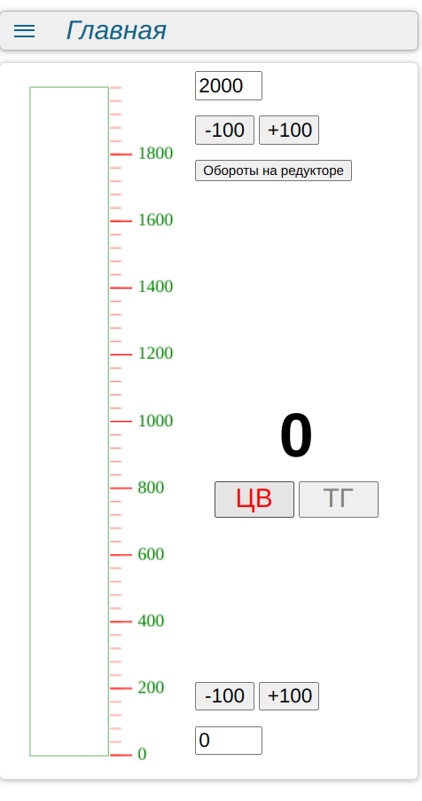
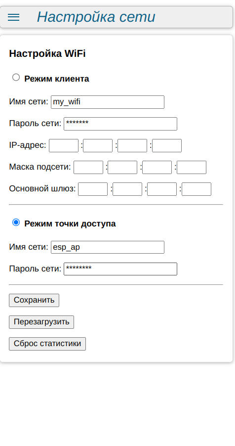

# ESP8266-frequency-meter
## Измеритель скорости вращения электродвигателей

Устройство производит замер и отображение в веб-интерфейсе скорости вращения одного из двух электродвигателей. Измерение производится от выбранного оптического датчика импульсов.
Отображение скорости вращения валов в виде индикаторной шкалы и числового значения. 

 
#### Управление и настройка контроллера:
Управление кортроллером может выполняться через веб-интерфейс из любого браузера.

- контроллер может работать в режиме WIFI-точки доступа;
- контроллер может работать в режиме WIFI-клиента для подключения к роутеру;
- автозапуск в режиме WIFI-точки доступа "По умолчанию" с настройками по умолчанию (для первичной настройки устройства);

Страницы для управление через веб-интерфейс:
- Страница управления и настройки реле (/index.htm);
- Страница сетевых настроек (/setup.htm);
- Страница файлового менеджера для просмотра, удаления и загрузки файлов (/edit.htm);
- Страница обновления прошивки контроллера (/update.htm);

|  |  |  |
|:---------:|:---------:|:---------:|

#### Используемые технологии:
- Web сервер (порт: 80) на устройстве для подключения к устройству по сети из любого web-браузера;
- Websocket сервер (порт: 81) на устройстве для обмена коммандами и данными между страницей в web-браузере и контроллером;
- mDNS-сервис на устройстве для автоматического определения IP-адреса устройства в сети;

#### Подключение выводов контроллера (для платы типа ESP8266 nodeMCU):
- GPIO2 (D4) - голубой wifi светодиод;
- GPIO4 (D2) - кнопка, подключена к пину (для платы типа ESP8266 nodeMCU);
- GPIO14 (D5) - вход импульсов от датчика стенда проверки ЦВ;
- GPIO5 (D1) - вход импульсов от датчика стенда проверки ТАХОГЕНЕРАТОРА;
